# 🏥 Hospital Management System

  

A robust, layered-architecture Hospital Management System built with **ASP.NET Core Web API**. This application enables the secure management of hospital records, including doctors, patients, and appointment scheduling, utilizing modern .NET development practices and dual-token authentication.

---

## 📑 Table of Contents
1. [Features](#features)
2. [Tech Stack](#tech-stack)
3. [Project Structure](#project-structure)
4. [Installation](#installation)
5. [Security Architecture](#security-architecture)
6. [API Documentation](#api-documentation-highlights)

---

## ⚙️ Features
- 🌐 **RESTful Architecture**: A pure Web API designed for seamless frontend integration.
- 📅 **Appointment Management**: Full CRUD operations with strict DTO validation.
- 🔐 **Identity Security**: Integrated ASP.NET Core Identity for secure session management and Role-Based Authorization (Admin/User).
- 🗄️ **Data Persistence**: Uses Entity Framework Core with migrations for structured SQL Server database management.
- 🔄 **Automation**: Includes Hangfire background cron jobs for automated database cleanup.
- 🛡️ **Advanced Auth**: Supports secure token-based authentication with automatic Refresh Token rotation.

---

## 🛠️ Tech Stack
- **C# & ASP.NET Core Web API**: The core language and framework used to build the RESTful backend architecture.
- **Entity Framework (EF) Core**: The ORM used to interact with the database using C# and LINQ.
- **Microsoft SQL Server**: The relational database used to store hospital records securely.
- **ASP.NET Core Identity & JWT**: Used for authentication, user management, and role-based authorization.
- **Hangfire**: Used for background job scheduling and automation.

---

## 📂 Project Structure
- `Controllers/`: API routing and HTTP request handling.
- `Services/`: Core business logic and database interactions.
- `DTOs/`: Data Transfer Objects for secure request/response shaping.
- `Models/`: Core domain entities (Doctor, Patient, ApplicationUser).
- `Database/`: ApplicationDbContext and database configurations.
- `Jobs/`: Hangfire automated background tasks.

---

## 🚀 Installation

1. **Clone the repository:**
```bash
git clone https://github.com/FelopaterAshraf/HospitalSystem_App.git
```

2. **Navigate to the folder:**
```bash
cd HospitalSystem_App
```

3. **Apply database migrations:**
```bash
dotnet ef database update
```

4. **Run the application:**
```bash
dotnet run
```

5. **Access the Dashboard:**
- Hangfire: http://localhost:5087/hangfire

---

## 🛡️ Security Architecture

Uses HTTP-only cookies to protect JWT tokens from XSS attacks. Tokens are automatically handled by the browser and cannot be accessed via JavaScript.

---

## 🌐 API Documentation Highlights

| Method | Endpoint | Description | Authorization |
|--------|----------|------------|--------------|
| POST | /api/auth/register | Register new user | Allow Anonymous |
| POST | /api/auth/login | Login & receive cookies | Allow Anonymous |
| POST | /api/auth/refresh | Rotate JWT | Valid Refresh Cookie |
| GET | /api/doctors | Get all doctors | Authorized |
| POST | /api/appointments | Schedule appointment | Authorized |
| DELETE | /api/patients/{id} | Delete patient | Admin Only |

---

---

## 📸 Postman API Verification & Testing

Below is the comprehensive testing documentation demonstrating the successful implementation of all core requirements, data validation, and security protocols.

### 🔐 Authentication & Security
**1. User Registration (Success)**
Demonstrates the creation of a new user account, automatically assigning default roles and hashing the password before saving to the SQL database.


**2. User Login & Token Generation**
Shows a successful authentication request. Notice the `HttpOnly` cookies generated in the response containing the JWT and the Refresh Token.
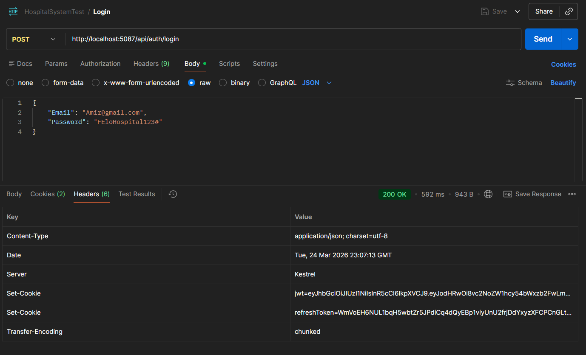

**3. Token Rotation (Refresh Endpoint)**
Demonstrates the advanced security feature where a valid Refresh Token is automatically exchanged for a brand new JWT and a new Master Key, securing the session.
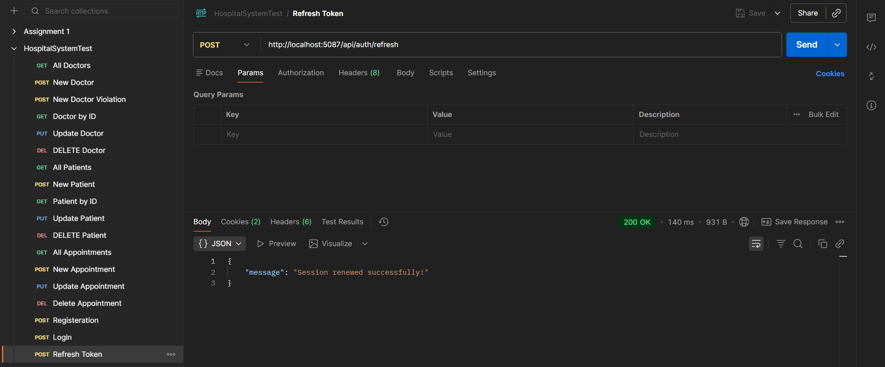

**4. Role-Based Authorization Violation (403 Forbidden)**
Proves the Identity framework is actively blocking standard users from accessing `Admin-Only` endpoints (e.g., attempting to delete a doctor without Admin privileges).
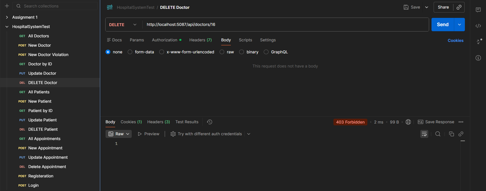

---

### 🩺 Doctor Management
**5. Create New Doctor (200 OK)**
Successfully adding a new doctor to the database using the Create DTO.
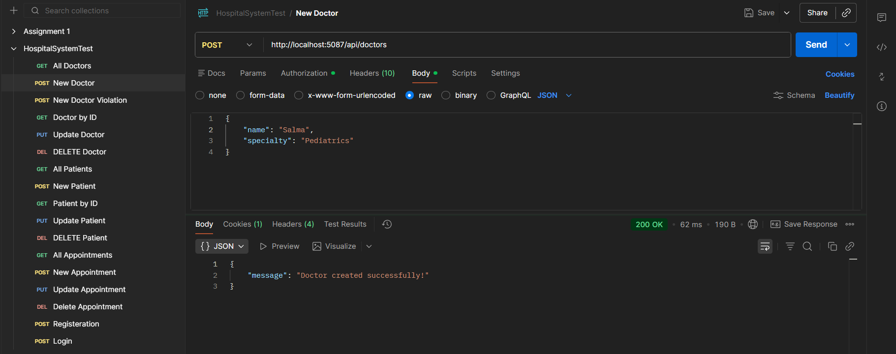

**6. DTO Data Validation Rule (400 Bad Request)**
Demonstrates the API catching invalid data (e.g., missing specialty, name too short) and rejecting the request before it reaches the database.
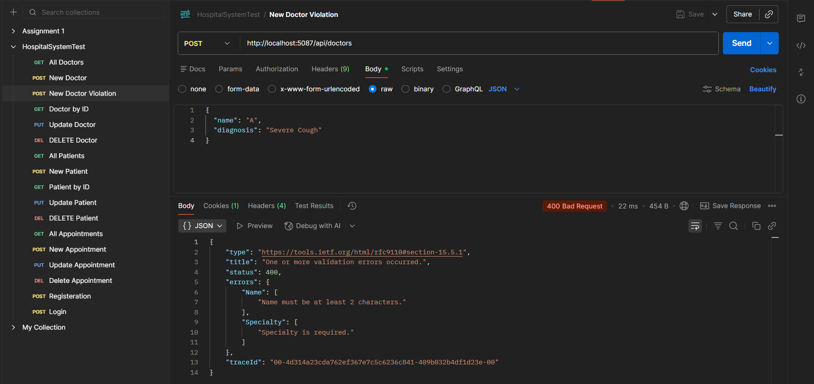

**7. Get All Doctors**
Retrieves the full list of available doctors using LINQ `.AsNoTracking()` for optimized read performance.
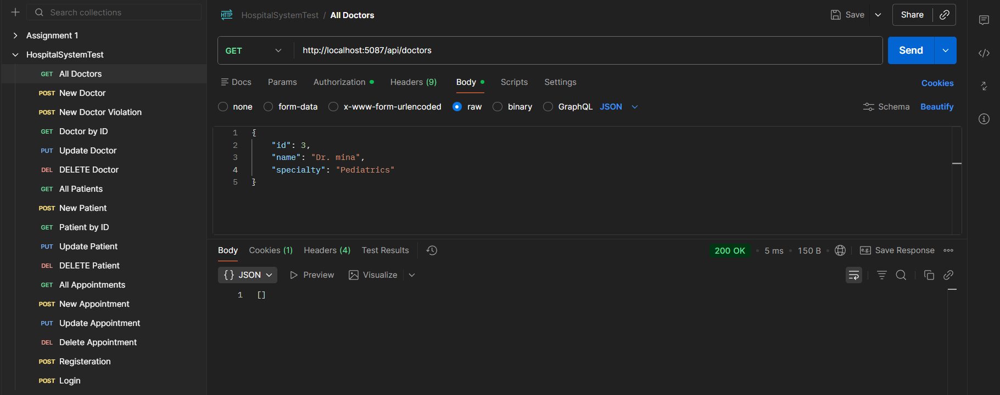

**8. Get Doctor By ID**
Retrieves a specific doctor's details mapped cleanly to a Response DTO.
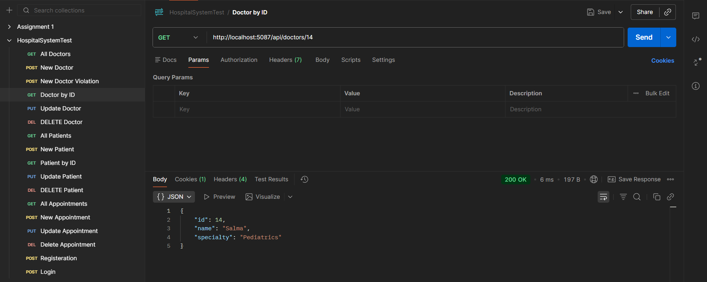

**9. Update Doctor Details**
Successfully modifying an existing doctor's record using the PUT method.
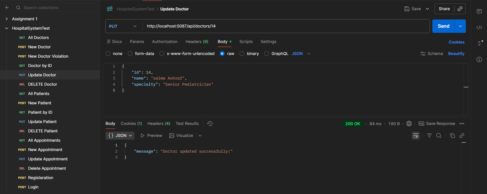

**10. Delete Doctor**
Successfully removing a doctor's record from the SQL database (Admin action).
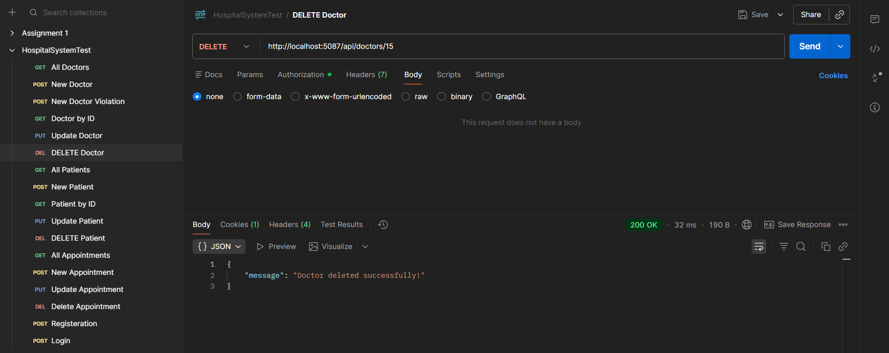

---

### 🤒 Patient Management
**11. Create New Patient**
Adding a new patient record to the system.
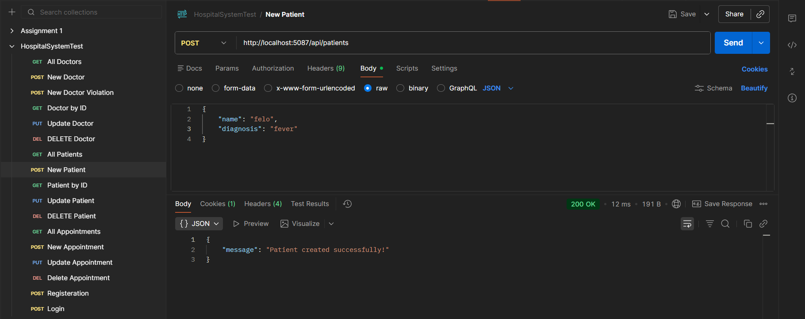

**12. Get All Patients**
Retrieving the list of registered patients.
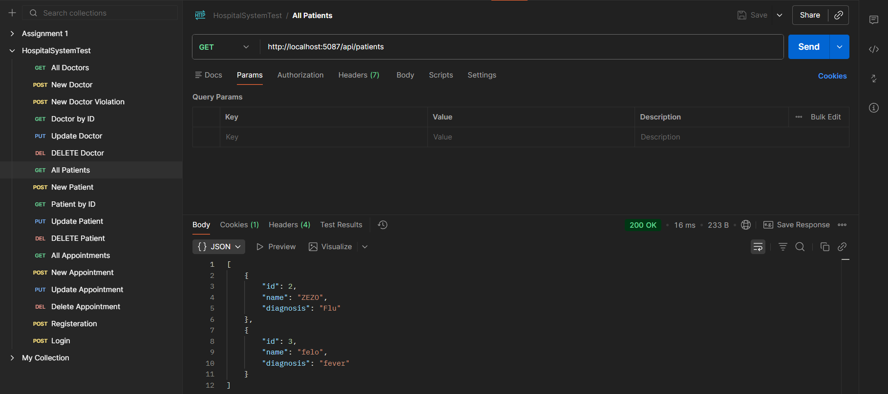

**13. Get Patient By ID**
Viewing a specific patient's secure medical profile.
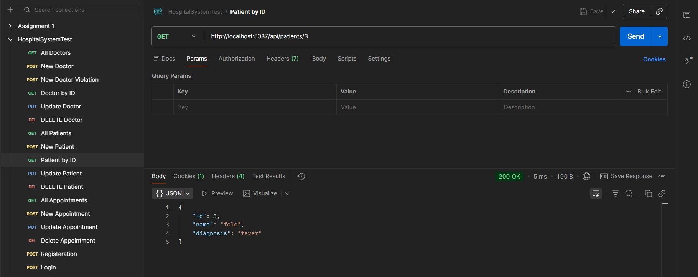

**14. Update Patient Details**
Modifying a patient's diagnostic information.
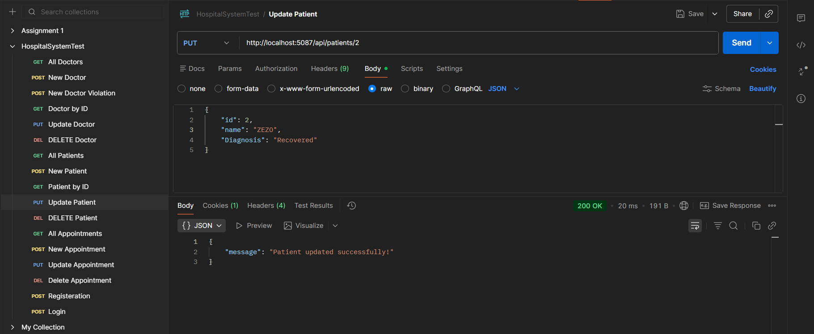

**15. Delete Patient Record**
Removing a patient from the system.
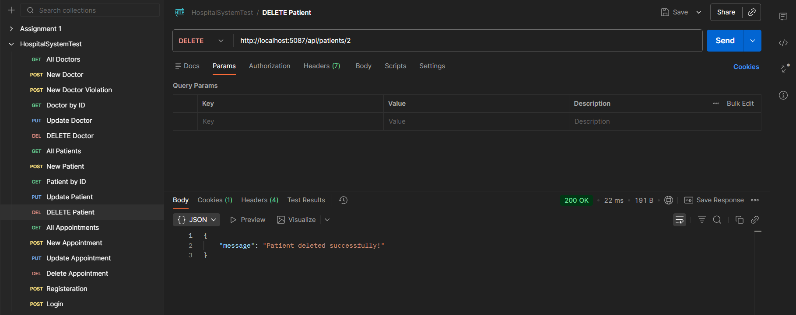

---

### 📅 Appointment Scheduling
**16. Create Appointment**
Successfully booking an appointment by linking a valid `PatientId` and `DoctorId`, demonstrating Entity Framework relational mapping.
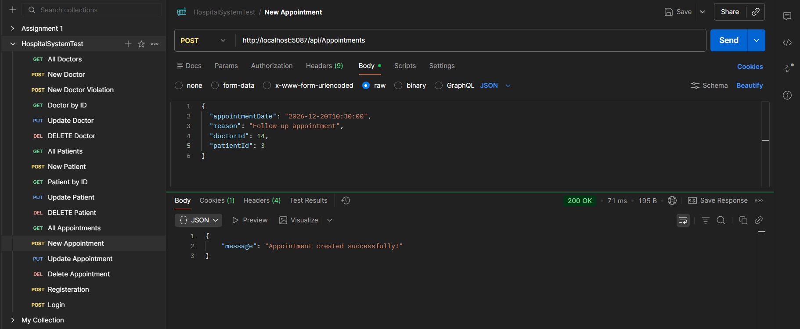

**17. Get All Appointments**
Viewing the active hospital schedule.
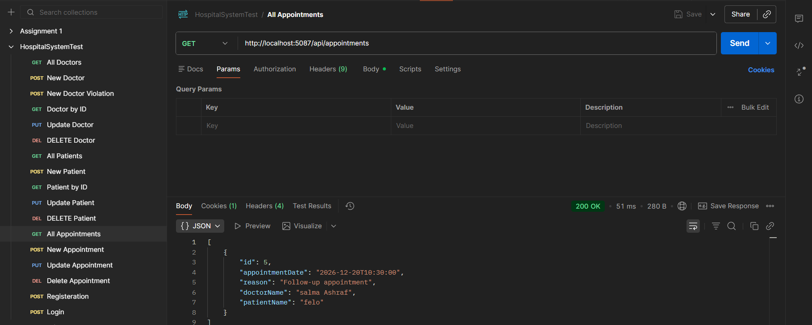

**18. Update Appointment Status**
Modifying the date, time, or reason for an existing scheduled appointment.
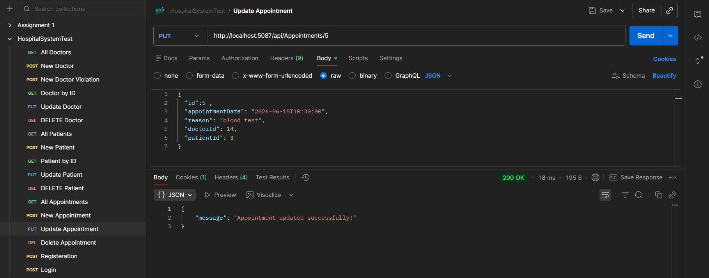

**19. Delete/Cancel Appointment**
Removing an appointment from the database.
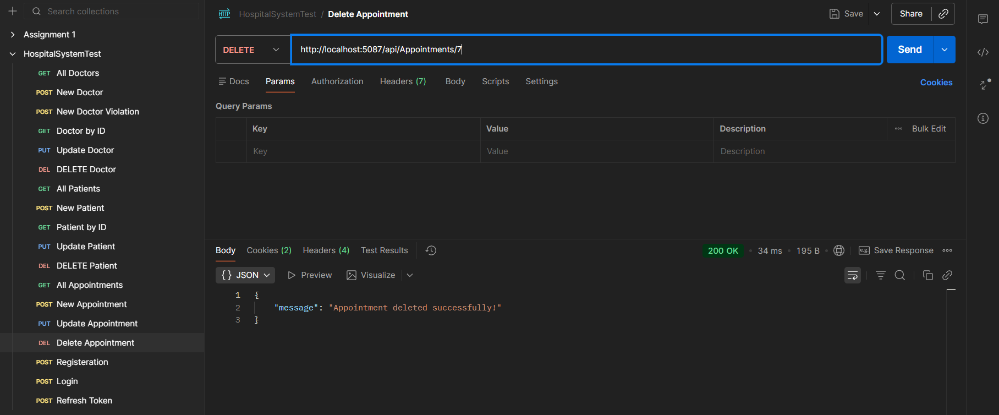

---

### ⚙️ Background Automation (Bonus Requirement)
**20. Hangfire Cron Job Scheduler**
Demonstrates the successful integration of the Hangfire dashboard. It shows the `DatabaseCleanupJob` successfully registered and scheduled to run automatically on a daily cron trigger (`0 0 * * *`) to purge outdated database records.
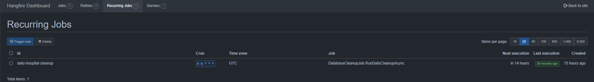

Developed by Felopater Ashraf.
